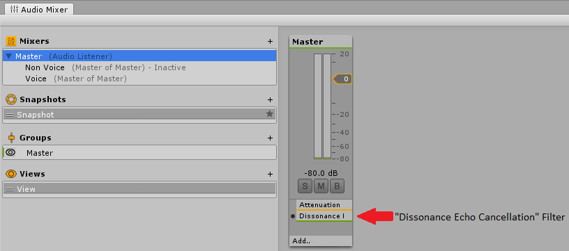
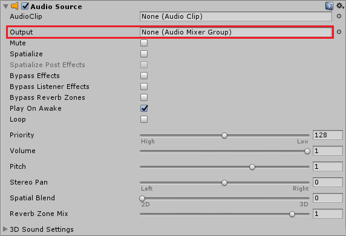
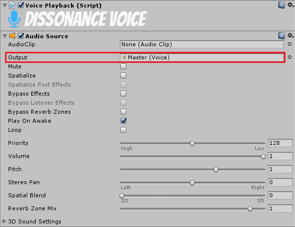
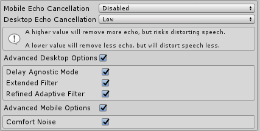
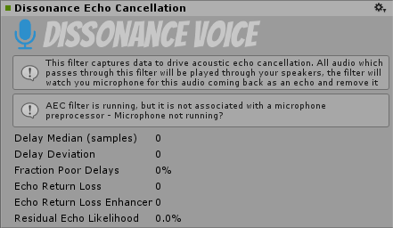
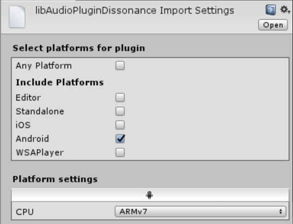

# Acoustic Echo Cancellation

When playing audio from speakers and recording audio from a nearby microphone you will often encounter problems when the microphone picks up the audio from the speakers. In a voice session a single person doing this can cause annoying echoes to be transmitted and multiple people doing this simultaneously can cause painful feedback which persists until everyone stops transmitting. This can be particularly problematic when using Voice Activation Detection (VAD) because the VAD automatically transmits back all speech it detects, causing constant echoes of everything other people say. It can also be very bad on platforms where the mic and the speaker are very close together such as VR headsets and mobile phones. Acoustic Echo Cancellation (AEC) is a system to automatically remove these echoes from the transmitted voice signal.

## How Does AEC Work?

Dissonance already runs an audio preprocessor on the microphone signal before it is transmitted, by default this is running Noise Suppression (NS) and Voice Detection (VAD). To enable AEC we introduce a postprocessor which has _all_ game audio passed through it - this postprocessor informs the microphone preprocessor what audio is about to be played through the speakers. With this knowledge the preprocessor can remove the echo signal from the microphone signal when it appears a short time later.

    Audio Output -> Audio Postprocessor -> Speakers -> Echo -> Microphone -> Audio Preprocessor

The most complex part of this system is working out what the delay is between the `Audio Postprocessor` and the `Audio Preprocessor`. This is achieved automatically but it is umportant to understand that the AEC system can take several seconds to work out the correct delay value - until it has done this no echo will be cancelled. The AEC cannot be calculating the delay value while there is no sound being played and it will slowly "forget" the delay value during periods of silence.

In most scenarios this is not a problem - game sound effects and background music will be enough to keep the AEC synchronised with a suitable delay value. However if you are encountering problems with the AEC not working you should consider adding some sound effects for the AEC to process - e.g. a short jingle when a user joins a session, or ringing sound when joining a session.

## AEC Setup

### 1. Audio Postprocessor

The first thing required for the AEC to function is to attach the postprocessor mentioned above to an [audio mixer](https://docs.unity3d.com/Manual/AudioMixer.html). Attach the `Dissonance Echo Cancellation` audio filter to the very last audio mixer in the mixing system and disable the `Auto Mixer Suspend` option for this mixer. If you were not already using audio mixers simply create a new mixer in `Window > Audio Mixer` and attach the filter to that.



### 2. Route Non-Voice Audio

The filter will only process audio which passes through the mixer it is attached to - how to achieve this depends on what kind of audio mixing system you already had setup before using AEC.

If you were already using audio mixers then ensure that all the mixers eventually pass through the filter with the `Dissonance Echo Cancellation` filter attached. If you were not already using mixers then simply set _all_ of the `AudioSource` components to output to the new mixer you created in the previous step.

You can check that you have done this correctly by running the game and watching the audio mixer window. The dB meter on the mixer should move when non-voice audio is playing.



### 3. Route Voice Audio

Voice audio also needs to be re-routed to pass through the mixer with the filter through the filter. To change where voice audio is sent you need to create a custom [playback prefab](/Tutorials/Playback-Prefab). Create a prefab with a `VoicePlayback` component and an `AudioSource` component. Set the output of the AudioSource to the correct mixer. Finally drop the prefab into the `Playback Prefab` field of the `Dissonance Comms` component.



If you were already using audio mixers then you may want to consider creating a mixer specifically for voice and outputting this mixer to the root mixer. This will allow you to attach sound effects specifically to voices.

If you were not using audio mixers then you should just send the voice data to the mixer you created in step 1.

### 4. AEC Configuration

Now that all the audio is routed to pass through the AEC filter AEC can run. Open the Dissonance quality settings menu `Window > Dissonance > Quality Settings` to set the amount of echo suppression applied. Desktop platforms and mobile platforms use completely different AEC systems internally and are configured separately. Dissonance will automatically switch to using the mobile AEC (AECM) when a mobile platform is detected.



These settings can be set in the editor - they will be saved into an asset and used as the default values at runtime. They can be changed at runtime by accessing the `VoiceSettings` class:

```csharp
//Change amount of AEC applied on Desktop
VoiceSettings.Instance.AecSuppressionAmount = AecSuppressionLevels.Moderate;

//Change amount of AEC applied on Mobile
VoiceSettings.Instance.AecmRoutingMode = AecmRoutingMode.Speakerphone;
```

Only the two settings shown above can be changed while Dissonance is running, doing so will trigger a reset of the audio input system (causing a small hitch in transmitted audio). Changes to any other AEC related settings will be ignored until the next time the audio input system is reset (e.g. by changing the settings above).

It is advisable to start with very low AEC settings and ask the user to increase them if echo becomes a problem - excessive levels of AEC can very badly distort voices.

### 5. Testing AEC

Once you have set all of this up you may want to test that AEC is working as intended. To do so simply add an `AudioSource` component to your scene playing some loud music - make sure it's routed through the correct mixer! Now run the scene in the editor and select the filter attached to the audio mixer, this will show a status screen for the AEC:



The second box shows the AEC status. In this image it is showing a warning - if everything is setup correctly it should show `AEC filter is running`.

When the filter first starts all of the numbers shown here will be zero or even negative. This indicates that the filter has not yet converged and will not yet be removing any echo. After a short period of time (5-10 seconds) it should converge and begin removing echoes, if `Fraction Poor Delays` is more than 0% then the AEC will likely perform very badly.

Once the AEC is running and has converged remote speakers in the session should not be able to hear the music you are playing. In our own tests we have had music playing loudly enough to drown out voices but even that was still cancelled!

# Fixing `Audio effect Dissonance Echo Cancellation could not be found.` Error

## iOS

To fix this problem on iOS you must manually register the audio effect with the Unity audio pipeline.

1. Download `AudioPluginInterface.h` from [the Unity native audio plugin SDK](https://github.com/Unity-Technologies/NativeAudioPlugins) and add it to your XCode project.
2. add `#import "AudioPluginInterface.h";` to `UnityAppController.mm` in XCode.
3. Find the `preStartUnity` method and add the line `UnityRegisterAudioPlugin(&UnityGetAudioEffectDefinitions);`

If this does not fix the issue, please add a comment to [this issue](https://github.com/Placeholder-Software/Dissonance/issues/80).

## Android

To fix this issue on Android you must re-import the plugin with the correct settings.

1. Remove `Assets/Plugins/Dissonance/Plugins/Android/libs/armeabi-v7a/libAudioPluginDissonance.so` from the project (ensure that the `libAudioPluginDissonance.so.meta` is gone).
2. Restart the Unity editor
3. Put `libAudioPluginDissonance.so` back into the `Assets/Plugins/Dissonance/Plugins/Android/libs/armeabi-v7a`
4. Configure the import settings:



6. Check that `libAudioPluginDissonance.so.meta` contains `isPreloaded: 1`

If this does not fix the problem, please add a comment to [this issue](https://github.com/Placeholder-Software/Dissonance/issues/110).