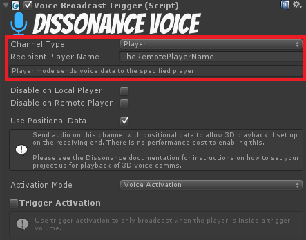
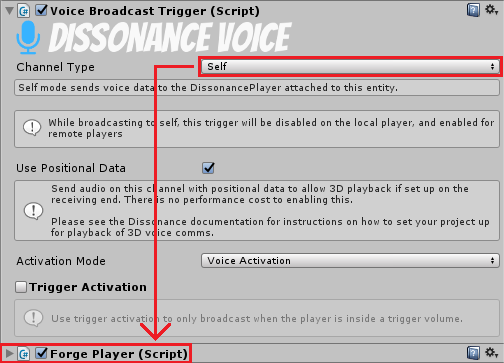

# Direct Player Messaging

Also see [this video](https://youtu.be/HXMYDbuLwVI?t=1064) about direct player messaging.

This tutorial will explain how to broadcast a voice message directly to a specific player, rather than to all players in a room. There are two ways to achieve this.

## Set The Player Name

To transmit to a specific player, change the Channel Type option on the `VoiceBroadcastTrigger` to "Player", then give the player name for Recipient Player Name.



To change the targetted player at run time modify the `PlayerId` field of the `VoiceBroadcastTrigger` behaviour.

```
GetComponent<VoiceBroadcastTrigger>().PlayerId = "TheNewRemotePlayerName";
```

## Target A Player Behaviour

If you have set up Dissonance [position tracking](Position-Tracking.md) in your game then the game objects which represent your players will all have a behaviour on them which implements the `IDissonancePlayer` interface. For example if you are using the Forge Networking integration this is the `ForgePlayer` component.

To transmit to this player change the Channel Type option on a `VoiceBroadcastTrigger` attached to the same game object to "Self".

