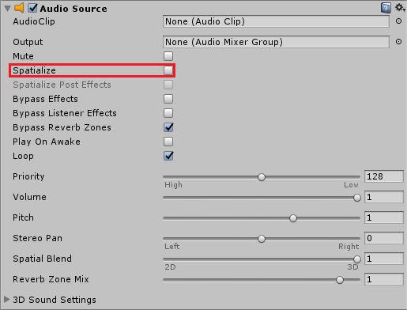

# Spatializer Plugins

Unity natively supports Audio Spatializers for virtual reality (VR) projects. To find out more about how to use an Audio Spatializer in your project refer to the [Unity documentation](https://docs.unity3d.com/Manual/VRAudioSpatializer.html). When *not* using a spatializer plugin Dissonance will automatically apply basic spatialization itself, this interferes with native spatialization plugins and must be disabled when using one.

Dissonance includes two default [playback prefabs](Playback-Prefab.md) in the `Assets/Plugins/Dissonance/Resources` directory. To begin using a spatialization plugin simply use the `SpatializedPlaybackPrefab` - all voices will now be spatialized using the spatializer plugin you have selected.

# Spatialization And Custom Playback Prefabs

If you are creating a custom playback prefab enaling spatialization is very simple - just tick the `Spatialize` checkbox on the AudioSource in the prefab.